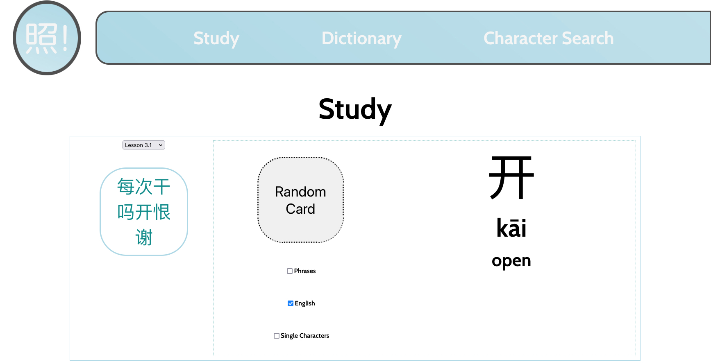

# 照! Mandarin Flashcards

照! Mandarin Flashcards is a React app made for practising Mandarin characters, organized in accordance with Canada Maple Press’s International Chinese Grading Courses books.

## Contributors

-   [Joel MacKenzie](https://github.com/joelmackenz)

## Technologies

-   React.js
-   JavaScript

## Usage

-   Check out a live demo here: https://flash-mandarin-flashcards.vercel.app/charactersearch

## Screenshoots

### User login/sign up

